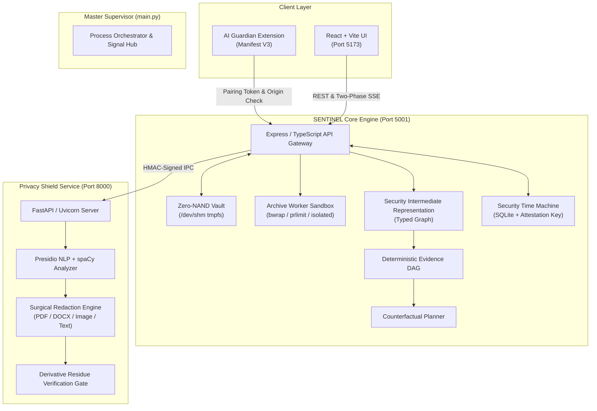

<div align="center">

# 🛡️ SENTINEL Sovereign Core v3.0

### **Evidence-Driven Security, Privacy & Integrity Verification Platform**

[]()
[]()
[]()
[-orange.svg?style=flat-square)]()
[]()

<p align="center">
  <b>SENTINEL</b> transforms security analysis from heuristic guesswork into mathematically verifiable, non-repudiable proof. Every check carries full execution provenance, deterministic intermediate representations, counterfactual resolution paths, and cryptographic attestations.
</p>

---

</div>

## 📑 Table of Contents
- [Executive Overview](#-executive-overview)
- [System Architecture](#-system-architecture)
- [The 8 Sovereign Invariants](#-the-8-sovereign-invariants)
- [The 5 Product Modules](#-the-5-product-modules)
  - [1. Threat Inspector & Deep Container Armor](#1-threat-inspector--deep-container-armor)
  - [2. Privacy Shield & Surgical Redaction](#2-privacy-shield--surgical-redaction)
  - [3. Content Integrity & Differential Perception](#3-content-integrity--differential-perception)
  - [4. Code Auditor & Toolchain Engine](#4-code-auditor--toolchain-engine)
  - [5. Fix & Verify (Time Machine & Counterfactual Planner)](#5-fix--verify-time-machine--counterfactual-planner)
- [AI Guardian: Hold-Before-Send Browser Extension](#-ai-guardian-hold-before-send-browser-extension)
- [Master Supervisor (`main.py`)](#-master-supervisor-mainpy)
- [Quick Start Guide](#-quick-start-guide)
- [Environment Configuration (`.env`)](#-environment-configuration-env)
- [REST & Two-Phase SSE API Reference](#-rest--two-phase-sse-api-reference)
- [Verification Gates & Testing](#-verification-gates--testing)

---

## 🏛️ Executive Overview

Modern security tools fail silently: if a scanner errors out, times out, or lacks a plugin, it routinely emits a green checkmark. **SENTINEL eliminates silent failures.**

```
Traditional Security:   Tool Missing / Error  ──►  "No threats detected" (False Clean) ❌
SENTINEL Sovereign:     Tool Missing / Error  ──►  "REVIEW REQUIRED" (Fail-Closed)     ✅
```

### Core Tenets:
1. **Absence of Detection $\neq$ Safety:** An incomplete or unconfigured scan degrades the verdict to `REVIEW REQUIRED`.
2. **Evidence, Not Vibes:** Every finding carries raw hex offsets, bounding boxes, AST nodes, and cryptographic receipts.
3. **Differential Perception:** We explicitly isolate what a human visual renderer sees versus what an LLM / tokenizer ingests to block stealth prompt injections.
4. **Zero-NAND RAM Vault:** Sensitive artifacts are processed strictly in volatile memory (`/dev/shm` on Linux, guarded ephemeral RAM vaults cross-platform) and scrubbed immediately after verification.

---

## 📐 System Architecture



---

## 🔒 The 8 Sovereign Invariants

Every subsystem in SENTINEL strictly adheres to 8 architectural laws:

| Invariant | Guarantee |
|---|---|
| **1. Fail-Closed Multi-Scanner Fusion** | Any scanner failure, missing prerequisite, or timeout immediately forces the global verdict to `REVIEW REQUIRED` or `BLOCKED`. |
| **2. Epistemic Status Differentiation** | Analyzers explicitly report: `completed`, `finding`, `failed`, `unavailable`, or `not_applicable`. |
| **3. Zero-NAND Ephemeral RAM Vault** | Payload bytes live only in RAM (`/dev/shm` tmpfs or memory buffers). Strict path containment and immediate unlinking prevent leakage. |
| **4. Differential Perception Isolation** | Compares human visual rendering against raw token stream extraction to detect invisible text, micro-fonts, and zero-width prompt injections. |
| **5. Transactional Twin Redaction** | Redactions execute on isolated twins. The derivative is re-parsed and verified to ensure 0% residue before releasing download tokens. |
| **6. Cryptographic Attestation (Ed25519 & HMAC)** | All SARIF inspection reports are signed using persistent local Ed25519 keys + machine HMAC roots for non-repudiation and tamper detection. |
| **7. Deterministic Evidence DAG & SIR** | Security Intermediate Representation maps all findings into an acyclic graph with SHA-256 node minimization. |
| **8. Counterfactual Dependency Remediation** | Calculates the minimal topological sequence of actions required to transition a `BLOCKED` or `REVIEW_REQUIRED` state into `ALLOWED`. |

---

## 🎛️ The 5 Product Modules

### 1. Threat Inspector & Deep Container Armor
- **Magic-Byte Identity:** Bypasses spoofed file extensions by inspecting true binary signatures.
- **Deep ZIP & Container Recursion:** Traverses nested archives up to 3 levels deep with decompression bomb protection (10:1 ratio limit, 50MB max extracted).
- **Executable Static Analysis (PE/EXE):** Disassembles headers, sections, imports, exports, entropy calculation, and embedded strings without executing binaries.
- **Office & PDF Parser:** Detects macros, external OLE/VBA relationships, DDE commands, and hidden metadata.

### 2. Privacy Shield & Surgical Redaction
- **Presidio NLP Engine:** Multi-lingual entity recognition (PII, SSN, Credit Cards, API Keys, Passwords, Names, Locations, IBAN).
- **Bidi & Unicode Sanitizer:** Strips zero-width characters, homoglyphs, and right-to-left override attacks.
- **Surgical Redaction:** Redacts text in PDFs, DOCX, images (bounding boxes), and plain text.
- **Fresh Derivative Residue Gate:** Re-extracts text from the generated output and asserts that 0 original sensitive tokens remain before issuing an expiring single-use download token.

### 3. Content Integrity & Differential Perception
- **Human vs LLM Disparity:** Identifies content crafted to be invisible to humans (font size $\le 1$, opacity 0, background-matching colors) but ingested by LLM tokenizers.
- **Prompt Injection Defense:** Flags jailbreaks, system-prompt extraction directives, and invisible delimiters.

### 4. Code Auditor & Toolchain Engine
- **Heuristic Static Analysis:** AST-level heuristic detection of hardcoded high-entropy secrets, unsafe TLS configs, command injections, and dangerous primitives.
- **Offline Toolchain Bridge:** Plugs directly into local `semgrep`, `gitleaks`, and `osv-scanner` binaries without sending code to third-party clouds.

### 5. Fix & Verify (Time Machine & Counterfactual Planner)
- **Security Time Machine:** Tracks historical versions of an artifact across time, computing epistemic diffs (new findings, resolved vulnerabilities, engine version drifts).
- **Counterfactual Planner:** Builds a blocker tree and returns the exact step-by-step checklist to achieve an `ALLOW` verdict.

---

## 🧩 AI Guardian: Hold-Before-Send Browser Extension

The included Manifest V3 browser extension intercepts prompts and attachments inside AI interfaces (ChatGPT, Claude, Gemini) **before** they leave your browser.

```
User types prompt / drops file ──► Intercept Event ──► SENTINEL Privacy & Threat Inspection
                                                              │
                                    ┌─────────────────────────┴─────────────────────────┐
                                    ▼                                                   ▼
                            Clean / Redacted                                    Threat / Violation
                                    │                                                   │
                            [Release Send]                                      [Hold & Warn User]
```

### Pairing Protocol:
1. Open Chrome $\rightarrow$ `chrome://extensions` $\rightarrow$ Load unpacked $\rightarrow$ Select `browser-extension/`.
2. Copy your Extension ID (e.g., `chrome-extension://abcdef...`).
3. Set `SENTINEL_EXTENSION_ORIGIN` and `SENTINEL_EXTENSION_TOKEN` in `.env`.
4. Enter the same Gateway URL (`http://127.0.0.1:5001`) and Secret Token in the Extension Settings modal.
5. All non-whitelisted or unauthenticated requests fail-closed with `403 Forbidden`.

---

## 🚀 Master Supervisor (`main.py`)

SENTINEL is supervised by a single Python orchestrator that handles process lifecycles, health probing, cross-platform environments, and atomic teardowns.

### Common Commands:

```bash
# 1. Start full production stack (FastAPI + Node API + React Client)
python main.py

# 2. Start in development mode with live hot-reloading
python main.py --dev

# 3. Start backend services only (FastAPI + Node API)
python main.py --server-only

# 4. Run the complete release acceptance test suite (8 PyTest + 79 Node Tests)
python main.py --test

# 5. Run the 5,000-case archive mutation fuzzer
python main.py --fuzz

# 6. Run the analyzer trust & calibration lab
python main.py --calibrate

# 7. Probe running daemon health
python main.py --health
```

---

## ⚡ Quick Start Guide

### Prerequisites
- **Python 3.11+** (managed via `uv` or standard virtual environment)
- **Node.js 18+** & `npm`

### Installation:

```bash
# 1. Clone repository
git clone https://github.com/Aviralgit1212/SENTINEL.git
cd SENTINEL

# 2. Setup Python environment with uv
uv venv
source .venv/bin/activate
uv pip install -r privacy-service/requirements.txt -r python-analyzers/requirements.txt

# 3. Install Node.js dependencies
cd server && npm ci && cd ..
cd client && npm ci && cd ..

# 4. Initialize environment configuration
cp .env.example .env

# 5. Launch the entire platform
python main.py
```

Access the UI at **`http://localhost:5173`**.

---

## ⚙️ Environment Configuration (`.env`)

| Variable | Default | Purpose |
|---|---|---|
| `SENTINEL_PORT` | `5001` | Port for the Node.js / Express Core API |
| `HOST` | `127.0.0.1` | Binding interface for the Core API |
| `PRIVACY_PORT` | `8000` | Port for FastAPI Privacy Shield |
| `PRIVACY_SERVICE_URL` | `http://127.0.0.1:8000` | IPC URL used by Node API |
| `SENTINEL_VAULT_TIER` | `ram` | `ram` (tmpfs `/dev/shm`) or `secure_temp` |
| `SENTINEL_SIGNING_KEY_PATH` | `./server/data/sentinel-signing.key` | Machine root HMAC key path |
| `SENTINEL_EXTENSION_ORIGIN` | `chrome-extension://...` | Authorized browser extension origin |
| `SENTINEL_EXTENSION_TOKEN` | *32+ char secret* | Shared token for extension pairing |
| `SENTINEL_SEMGREP_CONFIG` | `auto` | Local rule path for Semgrep analysis |

---

## 📡 REST & Two-Phase SSE API Reference

### 1. Two-Phase SSE Scan Stream
**`POST /api/v3/scan-stream`** (Multipart `file`)
Streams real-time diagnostic and execution events:
```bash
curl -N -F "file=@sample.pdf" http://127.0.0.1:5001/api/v3/scan-stream
```
*Emitted Events:* `intake_ack` $\rightarrow$ `analysis_started` $\rightarrow$ `sir_compiled` $\rightarrow$ `finding` $\rightarrow$ `counterfactual_plan` $\rightarrow$ `complete`

### 2. Standard Multipart File Inspection
**`POST /api/scans`**
```bash
curl -F "file=@document.docx" http://127.0.0.1:5001/api/scans
```

### 3. Deterministic Evidence DAG
**`GET /api/scans/:scanId/evidence`**
Returns the minimized directed acyclic graph linking artifacts, analyzers, findings, and policies.

### 4. Privacy Shield Text Inspection & Redaction
**`POST /api/privacy/scan-text`**
```bash
curl -X POST http://127.0.0.1:5001/api/privacy/scan-text \
  -H "Content-Type: application/json" \
  -d '{"text": "Contact Alice at alice@company.com with card 4532-0150-1234-5678"}'
```

### 5. Ed25519 & HMAC SARIF Receipt Verification
**`POST /api/attestations/verify`**
```bash
curl -X POST http://127.0.0.1:5001/api/attestations/verify \
  -H "Content-Type: application/json" \
  -d '{"sarif": {...}, "algorithm": "Ed25519"}'
```

---

## 🧪 Verification Gates & Testing

SENTINEL includes an uncompromising verification suite ensuring zero regressions and fail-closed correctness:

| Gate | Description | Verified Status |
|---|---|---|
| **Gate 01** | Zero-NAND RAM Vault & Cross-Platform Storage Isolation | ✅ Pass |
| **Gate 02** | Deep ZIP Archive Armor & Mutation Fuzzing (5,000 cases) | ✅ Pass |
| **Gate 03** | Presidio NLP & Fresh Derivative Residue Gate | ✅ Pass |
| **Gate 04** | Differential Perception & Invisible Tokenizer Isolation | ✅ Pass |
| **Gate 05** | Security Intermediate Representation (SIR) & Evidence DAG | ✅ Pass |
| **Gate 06** | Counterfactual Action Planner & Blocker Graph | ✅ Pass |
| **Gate 07** | Cryptographic Attestation (Ed25519 & Machine HMAC) | ✅ Pass |
| **Gate 08** | AI Guardian Extension Bridge & Origin-Bound Pairing | ✅ Pass |

Run the complete gate suite at any time:
```bash
python main.py --test
```

---

<div align="center">
  <sub>Built with precision for mission-critical security and sovereign data protection.</sub>
</div>
