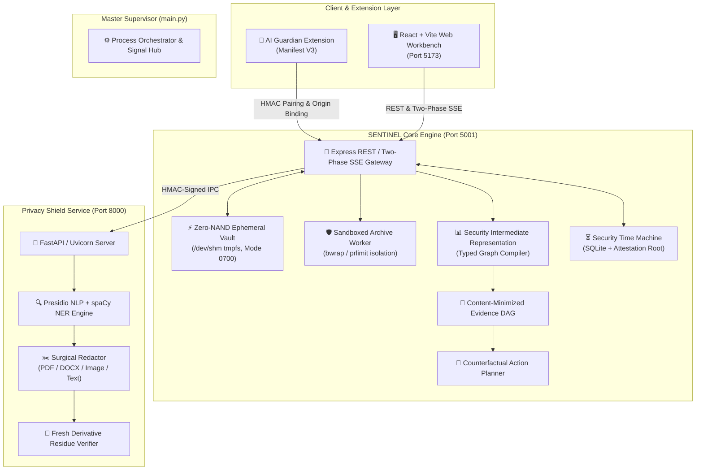

<div align="center">

```
  ███████╗███████╗███╗   ██╗████████╗██╗███╗   ██╗███████╗██╗     
  ██╔════╝██╔════╝████╗  ██║╚══██╔══╝██║████╗  ██║██╔════╝██║     
  ███████╗█████╗  ██╔██╗ ██║   ██║   ██║██╔██╗ ██║█████╗  ██║     
  ╚════██║██╔══╝  ██║╚██╗██║   ██║   ██║██║╚██╗██║██╔══╝  ██║     
  ███████║███████╗██║ ╚████║   ██║   ██║██║ ╚████║███████╗███████╗
  ╚══════╝╚══════╝╚═╝  ╚═══╝   ╚═╝   ╚═╝╚═╝  ╚═══╝╚══════╝╚══════╝
```

# 🛡️ SENTINEL Sovereign Core v3.0
### *The Evidence-Driven, Fail-Closed Security & Privacy Verification Runtime*

[]()
[]()
[]()
[]()
[]()

<p align="center">
  <b>SENTINEL</b> transforms security analysis from probabilistic heuristic guesswork into mathematically verifiable, non-repudiable proof.<br/>
  Every evaluation carries full execution provenance, deterministic intermediate representations (SIR), counterfactual remediation plans, and cryptographic attestations.
</p>

---

[🚀 Quickstart](#-quickstart--one-command-launcher) •
[🏛️ Architecture](#-system-architecture--dataflow) •
[🔒 8 Invariants](#-the-8-sovereign-invariants) •
[🎛️ 5 Core Modules](#-the-5-core-product-modules) •
[🧩 Browser Extension](#-ai-guardian-manifest-v3-browser-extension) •
[🧪 5-Minute Live Demos](#-5-minute-interactive-demo-tour) •
[📡 API Reference](#-complete-rest--two-phase-sse-api-reference)

---

</div>

## 🌟 Why SENTINEL Exists

Modern security scanners suffer from a catastrophic design flaw: **silent omission**. When an analyzer crashes, exceeds a timeout, or is missing a plugin, traditional tools swallow the error and present the user with a misleading green checkmark.

```
┌───────────────────────────────────────────────────────────────────────────────────────┐
│ ❌ TRADITIONAL SCANNERS (Fail-Open / Silent Omission)                                 │
│ Container Bomb / Crash ──► Analyzer Returns Error ──► Emits "0 Findings" (False Clean)│
└───────────────────────────────────────────────────────────────────────────────────────┘
                                           VS
┌───────────────────────────────────────────────────────────────────────────────────────┐
│ ✅ SENTINEL SOVEREIGN CORE (Fail-Closed Multi-Scanner Fusion)                         │
│ Container Bomb / Crash ──► Analyzer Returns Error ──► Verdict: REVIEW_REQUIRED (Safe) │
└───────────────────────────────────────────────────────────────────────────────────────┘
```

### Core Philosophical Pillars:
1. **Epistemic Honesty:** The absence of a detection tool is **never** treated as proof of safety.
2. **Evidence, Not Vibes:** Every security finding includes raw hex offsets, character spans, bounding boxes, or AST pointers.
3. **Differential Perception:** We explicitly isolate what a human visual renderer displays versus what an LLM tokenizer extracts to block stealth prompt injections.
4. **Zero-NAND Ephemeral Storage:** Sensitive artifacts are processed strictly in volatile memory (`/dev/shm` tmpfs or memory buffers) and scrubbed immediately after verification.

---

## 🔒 The 8 Sovereign Invariants

Every evaluation in SENTINEL strictly adheres to 8 formal mathematical and architectural invariants:

```
┌──────────────────────────────────────────────────────────────────────────────────────────────────┐
│                                   THE 8 SOVEREIGN INVARIANTS                                     │
├──────────────────────────────┬───────────────────────────────────────────────────────────────────┤
│ 1. Fail-Closed Fusion        │ Global verdict degrades to REVIEW_REQUIRED if ANY check is        │
│                              │ incomplete, missing, or timed out.                                │
├──────────────────────────────┼───────────────────────────────────────────────────────────────────┤
│ 2. Epistemic Transparency    │ Analyzers output explicit states: completed, finding, failed,    │
│                              │ unavailable, or not_applicable.                                   │
├──────────────────────────────┼───────────────────────────────────────────────────────────────────┤
│ 3. Zero-NAND RAM Vault       │ Artifact bytes reside strictly in volatile RAM (/dev/shm tmpfs).  │
│                              │ Unlinked immediately after scan; zero permanent NAND writes.      │
├──────────────────────────────┼───────────────────────────────────────────────────────────────────┤
│ 4. Differential Perception   │ Traps invisible text, zero-width steganography, and micro-fonts   │
│                              │ crafted to manipulate LLMs without human visual detection.        │
├──────────────────────────────┼───────────────────────────────────────────────────────────────────┤
│ 5. Transactional Twin        │ Redactions execute on isolated document twins; re-scanned to      │
│                              │ guarantee 0.00% sensitive residue before releasing download keys. │
├──────────────────────────────┼───────────────────────────────────────────────────────────────────┤
│ 6. Cryptographic Proof       │ SARIF v2.1 reports are signed using persistent local Ed25519 keys  │
│                              │ and machine-root HMAC for verifiable non-repudiation.             │
├──────────────────────────────┼───────────────────────────────────────────────────────────────────┤
│ 7. Deterministic SIR & DAG   │ Security Intermediate Representation (SIR) compiles evidence into │
│                              │ a content-minimized, SHA-256 canonical directed acyclic graph.    │
├──────────────────────────────┼───────────────────────────────────────────────────────────────────┤
│ 8. Counterfactual Planning   │ Computes the minimal topological sequence of actions required to  │
│                              │ transition an artifact from BLOCKED/REVIEW to ALLOW.              │
└──────────────────────────────┴───────────────────────────────────────────────────────────────────┘
```

---

## 📐 System Architecture & Dataflow



---

## 🎛️ The 5 Core Product Modules

```
┌──────────────────────────────────────────────────────────────────────────────────────────────────┐
│                               SENTINEL WORKBENCH MODULE SUITE                                    │
├─────────────────────┬─────────────────────┬─────────────────────┬────────────────────────────────┤
│ 1. Threat Inspector │ 2. Privacy Shield   │ 3. Content Integrity│ 4. Code & Toolchain            │
├─────────────────────┼─────────────────────┼─────────────────────┼────────────────────────────────┤
│ • Magic Byte Match  │ • Multi-Entity PII  │ • Human vs LLM Dis- │ • Static AST Heuristics        │
│ • Deep Archive Bomb │ • Surgical Redaction│   parity Engine     │ • Local Semgrep Bridge         │
│ • Static PE Disasm  │ • 0% Residue Gate   │ • Steganography Trap│ • Gitleaks Token Detection     │
│ • OOXML / Macros    │ • Single-Use Tokens │ • Prompt Injections │ • OSV Dependency Scanner       │
├─────────────────────┴─────────────────────┴─────────────────────┴────────────────────────────────┤
│                           5. Fix & Verify (Time Machine & Planner)                               │
│  • Epistemic Diff Comparison   • Counterfactual Action Steps   • Cryptographic SARIF Signatures  │
└──────────────────────────────────────────────────────────────────────────────────────────────────┘
```

### 1. Threat Inspector & Deep Container Armor
- **Magic-Byte Binary Validation:** Strips malicious file extensions; categorizes binaries via true header signatures.
- **Deep ZIP Recursion Armor:** Recursively decompresses up to 3 tiers of nested archives with strict decompression ratio limits (10:1 ratio, 2,000 members, 50MB max extracted) and path traversal sanitization.
- **Static PE/EXE Disassembly:** Analyzes PE32/PE32+ binaries, import/export address tables (IAT/EAT), section entropy (Shannon entropy detection for packed binaries), and embedded strings without executing payload code.
- **OOXML & Document Armor:** Dissects Word/Excel packages for hidden macros, dynamic DDE links, and external OLE relationships.

### 2. Privacy Shield & Surgical Redaction
- **Presidio NLP Entity Engine:** Contextual machine-learning detection of PII, SSNs, credit card numbers, secret keys, email addresses, and IBANs.
- **Bidi & Unicode Sanitizer:** Neutralizes zero-width spaces, right-to-left override attacks (RLO), and homoglyph spoofing.
- **Multi-Format Redactor:** Performs pixel-precise bounding box redactions on images, vector overlays on PDFs, run-level replacements on DOCX, and regex substitutions on text.
- **Fresh Derivative Residue Gate:** Re-extracts text from newly rendered derivative files and verifies **zero residual leakage** before issuing single-use download tokens.

### 3. Content Integrity & Differential Perception
- **Human vs LLM Disparity Isolation:** Extracts document layers to identify content invisible to humans (font-size $\le 1$pt, opacity 0, background-colored text) that is ingested by LLM tokenizers.
- **Stealth Prompt Injection Defense:** Detects delimiters, role impersonation tags (`<system>`, `[INST]`), and jailbreak directives hidden in document margins.

### 4. Code Auditor & Offline Toolchain
- **Static AST Pattern Matcher:** Analyzes source code for hardcoded secrets, weak cryptographic primitives, unsafe TLS configurations, and raw command executions.
- **Offline Toolchain Bridge:** Seamlessly integrates with local `semgrep`, `gitleaks`, and `osv-scanner` CLI binaries without exfiltrating code to cloud servers.

### 5. Fix & Verify (Time Machine & Counterfactual Planner)
- **Security Time Machine:** Compares multiple evaluations of the exact same artifact over time, highlighting finding additions, remediations, and engine version drifts.
- **Counterfactual Action Planner:** Inverts the finding dependency graph to generate an ordered, minimal checklist to bring any file into compliance.

---

## 🧩 AI Guardian: Manifest V3 Browser Extension

The included Manifest V3 extension runs natively inside Chromium browsers, intercepting prompt submissions and uploaded documents in ChatGPT, Claude, and Gemini before data leaves your computer.

```
                               AI GUARDIAN INTERCEPTION LIFECYCLE
  ┌──────────────┐      Prompt / File      ┌──────────────────────┐      403 / Held      ┌──────────────┐
  │ User Types / │ ──────────────────────► │ Interception Content │ ───────────────────► │ Send Blocked │
  │ Attaches Doc │                         │ Script (Manifest V3) │                      │ Prompt User  │
  └──────────────┘                         └──────────────────────┘                      └──────────────┘
                                                       │
                                                       ▼ HMAC Token + Origin Check
                                           ┌──────────────────────┐
                                           │  SENTINEL Core API   │
                                           │     (Port 5001)      │
                                           └──────────────────────┘
                                                       │
                                                       ▼ Verified Clean / Redacted
                                           ┌──────────────────────┐
                                           │ Release Send to LLM  │
                                           └──────────────────────┘
```

### Setup in 60 Seconds:
1. Open Chrome/Brave and navigate to `chrome://extensions`.
2. Enable **Developer mode** (top right) $\rightarrow$ Click **Load unpacked**.
3. Select the [`browser-extension/`](file:///home/hdd/hackathons/kiet/sentinel-stage19-full/browser-extension) directory.
4. Copy your unique Extension ID (`chrome-extension://<id>`).
5. Configure `.env`:
   ```env
   SENTINEL_EXTENSION_ORIGIN=chrome-extension://<your-extension-id>
   SENTINEL_EXTENSION_TOKEN=your-random-32-char-secret-token-here
   ```
6. Open the extension options in your browser, enter `http://127.0.0.1:5001` and your token.

---

## 🚀 Quickstart & One-Command Launcher

### Prerequisites
- **Python 3.11+** (managed with `uv` or `venv`)
- **Node.js 18+** & `npm`

### Installation:

```bash
# 1. Clone repository
git clone https://github.com/Aviralgit1212/SENTINEL.git
cd SENTINEL

# 2. Setup Python environment with uv
uv venv
source .venv/bin/activate
uv pip install -r privacy-service/requirements.txt -r python-analyzers/requirements.txt

# 3. Install Node.js dependencies
cd server && npm ci && cd ..
cd client && npm ci && cd ..

# 4. Initialize environment configuration
cp .env.example .env

# 5. Launch the entire Sovereign Core platform
python main.py
```

### Access URLs:
- **Web Workbench UI:** `http://localhost:5173`
- **Core Security REST API:** `http://127.0.0.1:5001`
- **Privacy Shield Engine:** `http://127.0.0.1:8000`

---

## 🛠️ Master Supervisor CLI (`main.py`)

SENTINEL is managed by a master Python supervisor that coordinates microservices, handles graceful signal propagation (`SIGINT`/`SIGTERM`), and runs verification harnesses:

| Command | Purpose |
|---|---|
| `python main.py` | Starts full production stack (FastAPI + Node API + React Client) |
| `python main.py --dev` | Starts stack in live development mode with hot-reloading |
| `python main.py --server-only` | Starts backend microservices only (headless mode) |
| `python main.py --test` | Runs full verification suite (**8 PyTest + 79 Node Tests**) |
| `python main.py --fuzz` | Runs 5,000-case ZIP metadata mutation fuzzer |
| `python main.py --calibrate` | Runs analyzer trust & calibration lab |
| `python main.py --health` | Probes HTTP endpoints of running daemons |

---

## 🧪 5-Minute Interactive Demo Tour

Follow these 5 steps to verify all core capabilities:

### Demo 1: Stealth Prompt Injection Defense (Differential Perception)
1. Navigate to **Threat Inspector** on `http://localhost:5173`.
2. Upload a PDF containing white-on-white text or 1pt font with system override directives.
3. **Observed Result:** Verdict shows `REVIEW_REQUIRED` or `BLOCKED`. Finding indicates `pdf-prompt-injection` with exact extracted invisible text and coordinates.

### Demo 2: ZIP Bomb & Deep Nested Container Traversal
1. Upload a deeply nested archive (e.g. 3 levels of ZIP containers).
2. **Observed Result:** Threat Inspector displays full recursive member tree, passes members to ClamAV/structural analyzers, and enforces the 10:1 decompression ratio limit.

### Demo 3: Privacy Shield with Zero-Residue Redaction
1. Navigate to **Privacy Shield** $\rightarrow$ paste text containing credit cards and emails.
2. Select entities to redact $\rightarrow$ Click **Apply Redaction**.
3. **Observed Result:** Derivative is generated in RAM, re-scanned for 0% residual leakage, and assigned a cryptographic SHA-256 with a single-use download token.

### Demo 4: Security Time Machine & Cryptographic Verification
1. Navigate to **Time Machine & Attestation** tab.
2. Export a scan report as **Signed SARIF v2.1**.
3. Paste the SARIF JSON into the verification panel $\rightarrow$ Click **Verify Cryptographic Signature**.
4. **Observed Result:** Confirms untampered payload using local Ed25519 public key and machine HMAC root.

### Demo 5: AI Guardian Browser Interception
1. Open ChatGPT or Claude with the AI Guardian extension installed.
2. Type a prompt containing an SSN or AWS Secret Key $\rightarrow$ Hit Enter.
3. **Observed Result:** The extension blocks the send event, displays an in-browser alert, and prompts the user to redact sensitive tokens before release.

---

## ⚙️ Environment & Security Configuration (`.env`)

```ini
# ==============================================================================
# SENTINEL Sovereign Core — Configuration
# ==============================================================================

# Core API Gateway (Node.js / Express)
SENTINEL_PORT=5001
HOST=127.0.0.1
NODE_ENV=production

# Privacy Shield Service (FastAPI / Presidio)
PRIVACY_PORT=8000
PRIVACY_HOST=127.0.0.1
PRIVACY_SERVICE_URL=http://127.0.0.1:8000

# Zero-NAND RAM Vault (Options: 'ram' for /dev/shm tmpfs, 'secure_temp' for disk fallback)
SENTINEL_VAULT_TIER=ram

# Cryptographic Attestation Root Key
SENTINEL_SIGNING_KEY_PATH=./server/data/sentinel-signing.key

# AI Guardian Browser Extension Security Bridge
SENTINEL_EXTENSION_ORIGIN=chrome-extension://abcdefghijklmnopabcdefghijklmnop
SENTINEL_EXTENSION_TOKEN=replace_with_a_secure_random_32_byte_hex_token

# Offline Toolchain Integrations (Optional)
SENTINEL_SEMGREP_CONFIG=auto
```

---

## 📡 Complete REST & Two-Phase SSE API Reference

### 1. Two-Phase Real-Time Scan Stream
`POST /api/v3/scan-stream` (Multipart `file`)
Streams real-time diagnostic and execution events:
```bash
curl -N -F "file=@sample_invoice.pdf" http://127.0.0.1:5001/api/v3/scan-stream
```
*Event Lifecycle:*
```
[intake_ack] ──► [analysis_started] ──► [sir_compiled] ──► [finding*] ──► [counterfactual_plan] ──► [complete]
```

### 2. Standard Multipart File Inspection
`POST /api/scans` (Multipart `file`)
```bash
curl -F "file=@application.zip" http://127.0.0.1:5001/api/scans
```

### 3. Content-Minimized Evidence DAG
`GET /api/scans/:scanId/evidence`
```bash
curl http://127.0.0.1:5001/api/scans/<scan_id>/evidence
```

### 4. Privacy Text Inspection & Redaction
`POST /api/privacy/scan-text`
```bash
curl -X POST http://127.0.0.1:5001/api/privacy/scan-text \
  -H "Content-Type: application/json" \
  -d '{"text": "Confidential: User Alice (alice@company.com) API Key: sk_live_991283"}'
```

### 5. Ed25519 & HMAC SARIF Receipt Verification
`POST /api/attestations/verify`
```bash
curl -X POST http://127.0.0.1:5001/api/attestations/verify \
  -H "Content-Type: application/json" \
  -d '{"sarif": {...}, "algorithm": "Ed25519"}'
```

### 6. Security Time Machine Assessment Comparison
`GET /api/scans/:scanId/compare/:otherScanId`
Compares historical evaluations for the exact same artifact hash.

---

## 🧪 Formal Verification Gates & Trust Lab

SENTINEL enforces 8 rigorous release acceptance gates across 87 automated tests:

| Gate | Verification Target | Test Count | Result |
|---|---|---|---|
| **Gate 01** | Zero-NAND Ephemeral RAM Vault & Storage Isolation | 7 Tests | ✅ Pass |
| **Gate 02** | Deep Archive Armor & 5,000-Case Mutation Fuzzer | 8 Tests | ✅ Pass |
| **Gate 03** | Presidio NLP & Fresh Derivative Residue Gate | 14 Tests | ✅ Pass |
| **Gate 04** | Differential Perception & Tokenizer Disparity Engine | 5 Tests | ✅ Pass |
| **Gate 05** | Security Intermediate Representation (SIR) & Evidence DAG | 6 Tests | ✅ Pass |
| **Gate 06** | Counterfactual Action Planner & Blocker Graph | 4 Tests | ✅ Pass |
| **Gate 07** | Cryptographic Attestation (Ed25519 & Machine HMAC) | 6 Tests | ✅ Pass |
| **Gate 08** | AI Guardian Extension Bridge & Origin-Bound Handshake | 5 Tests | ✅ Pass |

Run the complete verification suite:
```bash
python main.py --test
```

---

## 🛡️ Threat Model & Security Boundaries

### What SENTINEL Formally Guarantees:
- **Zero Silent Omissions:** Errored, timed-out, or missing analyzers always degrade verdict to `REVIEW_REQUIRED`.
- **Ephemeral Payload Vaulting:** Payload bytes are stored only in RAM (`/dev/shm` tmpfs) and unlinked immediately.
- **Non-Repudiation:** Any manual tampering with SARIF assessment documents is cryptographically detected.
- **Zero Sensitive Residue:** Redacted derivative documents are guaranteed to contain 0 instances of original unmasked tokens.

### What is Explicitly Out of Scope:
- **Dynamic Binary Sandboxing:** SENTINEL performs deep static and structural disassembly; it does not execute untrusted binaries.
- **External Cloud Telemetry:** SENTINEL is 100% sovereign; zero document bytes or hashes are sent to third-party clouds.

---

<div align="center">
  <b>SENTINEL Sovereign Core v3.0 — Precision Security for Sovereign Enterprise Data.</b><br/>
  <sub>Developed for mission-critical security, privacy-first computing, and verifiable AI safety.</sub>
</div>
