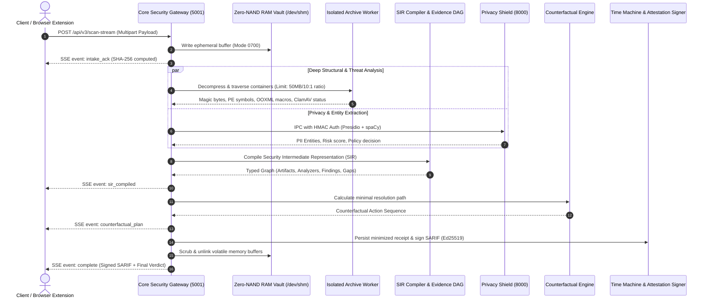

<div align="center">

```
  ███████╗███████╗███╗   ██╗████████╗██╗███╗   ██╗███████╗██╗     
  ██╔════╝██╔════╝████╗  ██║╚══██╔══╝██║████╗  ██║██╔════╝██║     
  ███████╗█████╗  ██╔██╗ ██║   ██║   ██║██╔██╗ ██║█████╗  ██║     
  ╚════██║██╔══╝  ██║╚██╗██║   ██║   ██║██║╚██╗██║██╔══╝  ██║     
  ███████║███████╗██║ ╚████║   ██║   ██║██║ ╚████║███████╗███████╗
  ╚══════╝╚══════╝╚═╝  ╚═══╝   ╚═╝   ╚═╝╚═╝  ╚═══╝╚══════╝╚══════╝
```

### **SENTINEL Sovereign Core v3.0**
#### *The Evidence-Driven, Fail-Closed Security & Privacy Verification Runtime*

[]()
[]()
[]()
[]()
[]()

<p align="center">
  <b>SENTINEL</b> transforms security auditing from probabilistic guesswork into mathematically verifiable proof.<br/>
  Every evaluation carries full execution provenance, deterministic intermediate representations (SIR), counterfactual remediation plans, and cryptographic attestations.
</p>

---

</div>

## 📑 Table of Contents
1. [The Problem: Silent Security Failures](#-the-problem-silent-security-failures)
2. [The 8 Sovereign Invariants](#-the-8-sovereign-invariants)
3. [System Architecture & Dataflow](#-system-architecture--dataflow)
4. [The 5 Core Modules](#-the-5-core-modules)
   - [1. Threat Inspector & Deep Container Armor](#1-threat-inspector--deep-container-armor)
   - [2. Privacy Shield & Surgical Redaction](#2-privacy-shield--surgical-redaction)
   - [3. Content Integrity & Differential Perception](#3-content-integrity--differential-perception)
   - [4. Code Auditor & Offline Toolchain](#4-code-auditor--offline-toolchain)
   - [5. Fix & Verify (Time Machine & Counterfactual Planner)](#5-fix--verify-time-machine--counterfactual-planner)
5. [AI Guardian: Manifest V3 Browser Extension](#-ai-guardian-manifest-v3-browser-extension)
6. [Master Supervisor CLI (`main.py`)](#-master-supervisor-cli-mainpy)
7. [Quickstart & Installation](#-quickstart--installation)
8. [Environment & Security Configuration (`.env`)](#-environment--security-configuration-env)
9. [Complete REST & Two-Phase SSE API Reference](#-complete-rest--two-phase-sse-api-reference)
10. [Formal Verification Gates & Trust Lab](#-formal-verification-gates--trust-lab)
11. [Threat Model & Security Boundaries](#-threat-model--security-boundaries)

---

## 🛑 The Problem: Silent Security Failures

Traditional scanners and compliance tools operate on a dangerous assumption: **"If no scanner caught a vulnerability, the file is clean."**

In enterprise workflows, tools routinely fail due to timeouts, missing sub-analyzers, malformed headers, or unhandled format features. Traditional tools catch the error and emit a false green checkmark.

```
┌─────────────────────────────────────────────────────────────────────────────┐
│ ❌ TRADITIONAL SCANNERS (Fail-Open / Silent Omission)                        │
│ Container Bomb / Crash ──► Analyzer Returns Error ──► Emits "0 Findings"    │
└─────────────────────────────────────────────────────────────────────────────┘
                                      VS
┌─────────────────────────────────────────────────────────────────────────────┐
│ ✅ SENTINEL SOVEREIGN CORE (Fail-Closed Multi-Scanner Fusion)                │
│ Container Bomb / Crash ──► Analyzer Returns Error ──► Verdict: REVIEW_REQ   │
└─────────────────────────────────────────────────────────────────────────────┘
```

SENTINEL enforces **Epistemic Honesty**: every scanner explicitly outputs its execution state (`completed`, `finding`, `failed`, `unavailable`, `not_applicable`). An incomplete scan **never** receives an `ALLOW` verdict.

---

## 🔒 The 8 Sovereign Invariants

Every subsystem within SENTINEL adheres to 8 mathematically verifiable laws:

```
                                  SENTINEL SOVEREIGN CORE
  ┌────────────────────────────────────────────────────────────────────────────────────────┐
  │ 1. Fail-Closed Fusion       │ Degrades verdict to REVIEW_REQUIRED if any tool fails.   │
  │ 2. Epistemic Transparency   │ Distinguishes absence of tools from absence of threats.  │
  │ 3. Zero-NAND RAM Vault      │ Payload bytes reside exclusively in volatile RAM/tmpfs.  │
  │ 4. Differential Perception  │ Traps prompt injections hidden from human sight.         │
  │ 5. Transactional Twin       │ Redactions execute on copies; verified for 0% residue.   │
  │ 6. Cryptographic Proof      │ SARIF exports signed with Ed25519 & machine HMAC root.   │
  │ 7. Deterministic SIR & DAG  │ Content-minimized directed acyclic graph for evidence.   │
  │ 8. Counterfactual Planning  │ Computes topological sequence of actions to reach ALLOW. │
  ╚════════════════════════════════════════════════════════════════════════════════════════╝
```

---

## 📐 System Architecture & Dataflow



---

## 🎛️ The 5 Core Modules

### 1. Threat Inspector & Deep Container Armor
- **Magic-Byte Identity Engine**: Ignores file extensions; verifies headers via raw binary signatures.
- **Deep ZIP & Archive Armor**: Inspects nested archives up to 3 tiers deep. Enforces strict decompression limits (10:1 ratio, 2,000 members, 50MB max extracted) with sandbox isolation (`bwrap` on Linux, guarded subprocess cross-platform).
- **Executable Static Disassembler (PE/EXE)**: Parses PE32/PE32+ headers, sections, export tables, import tables, compiler anomalies, and Shannon entropy without executing code.
- **OOXML & PDF Structural Analysis**: Detects embedded VBA/macros, external dynamic relationships, DDE execution vectors, and corrupted xref tables.

### 2. Privacy Shield & Surgical Redaction
- **Presidio NLP Entity Engine**: High-precision recognition of PII, SSNs, credit cards, passport numbers, API credentials, and IBAN codes.
- **Unicode & Bidi Armor**: Detects and neutralizes zero-width characters, homoglyphs, and right-to-left (RLO) directional override attacks.
- **Multi-Format Redactor**: Executes surgical masking across PDF documents, DOCX files, images (bounding boxes), and raw text.
- **Fresh Derivative Residue Gate**: Before issuing an expiring single-use download token, SENTINEL re-extracts the text from the generated file and verifies **0% residue of original sensitive terms**.

### 3. Content Integrity & Differential Perception
- **Human vs LLM Disparity Analyzer**: Identifies content hidden from humans (opacity 0, 1pt micro-fonts, white-on-white text, invisible layers) designed to hijack LLMs.
- **Stealth Prompt Injection Defense**: Flags jailbreaks, system-prompt extraction directives, and invisible delimiters.

### 4. Code Auditor & Offline Toolchain
- **AST Static Heuristics**: Immediate detection of hardcoded high-entropy tokens, private keys, insecure TLS configurations, and raw command execution.
- **Local Offline Bridge**: Connects seamlessly with local installations of `semgrep`, `gitleaks`, and `osv-scanner` without leaking code to cloud endpoints.

### 5. Fix & Verify (Time Machine & Counterfactual Planner)
- **Security Time Machine**: Queries historical evaluations by SHA-256, performing epistemic diffs showing new findings, fixed bugs, and rule version drift.
- **Counterfactual Dependency Planner**: Inverts the finding blocker graph and returns the exact topological steps required to transition a file to `ALLOW`.

---

## 🧩 AI Guardian: Manifest V3 Browser Extension

The included Manifest V3 extension intercepts prompts and uploaded attachments inside AI portals (ChatGPT, Claude, Gemini) **before** they leave your device.

```
[User Types Prompt / Drops File]
              │
              ▼
    [Extension Interceptor]
              │
              ▼ (HMAC Authentication & Origin Check)
    [SENTINEL Sovereign Gateway (Port 5001)]
              │
      ┌───────┴────────────────────────┐
      ▼                                ▼
[Verdict: ALLOW]               [Verdict: BLOCK / REDACT]
      │                                │
[Release Send to LLM]          [Hold Send & Request User Review]
```

### Setup Instructions:
1. Open Google Chrome or Brave $\rightarrow$ navigate to `chrome://extensions`.
2. Enable **Developer Mode** $\rightarrow$ Click **Load Unpacked** $\rightarrow$ Select the [`browser-extension/`](file:///home/hdd/hackathons/kiet/sentinel-stage19-full/browser-extension) folder.
3. Note your extension origin ID (`chrome-extension://<id>`).
4. Set `SENTINEL_EXTENSION_ORIGIN` and `SENTINEL_EXTENSION_TOKEN` in `.env`.
5. Open the Extension options popup, enter `http://127.0.0.1:5001` and your secret token.

---

## 🚀 Master Supervisor CLI (`main.py`)

SENTINEL is orchestrated by a unified Python supervisor supporting multiple execution and verification modes:

```bash
# Start full production stack (FastAPI + Node Core API + React UI)
python main.py

# Start with live hot-reloading (FastAPI reload + tsx dev server)
python main.py --dev

# Start headless backend microservices only
python main.py --server-only

# Run full release acceptance test suite (8 PyTest + 79 Node tests)
python main.py --test

# Run 5,000-case ZIP mutation fuzzer
python main.py --fuzz

# Run analyzer trust & calibration lab
python main.py --calibrate

# Probe health of running background daemons
python main.py --health
```

---

## ⚡ Quickstart & Installation

### Prerequisites
- **Python 3.11+** (`uv` recommended)
- **Node.js 18+** & `npm`

```bash
# 1. Clone repository
git clone https://github.com/Aviralgit1212/SENTINEL.git
cd SENTINEL

# 2. Setup Python environment using uv
uv venv
source .venv/bin/activate
uv pip install -r privacy-service/requirements.txt -r python-analyzers/requirements.txt

# 3. Install frontend & server dependencies
cd server && npm ci && cd ..
cd client && npm ci && cd ..

# 4. Configure environment
cp .env.example .env

# 5. Launch SENTINEL
python main.py
```

Web UI is available at: **`http://localhost:5173`**  
Core Security REST API: **`http://127.0.0.1:5001`**  
Privacy Shield API: **`http://127.0.0.1:8000`**

---

## ⚙️ Environment & Security Configuration (`.env`)

| Variable | Default | Purpose | Security Implication |
|---|---|---|---|
| `SENTINEL_PORT` | `5001` | Core Security API port | Bind to `127.0.0.1` in production |
| `HOST` | `127.0.0.1` | Network interface binding | Prevents external LAN access |
| `PRIVACY_PORT` | `8000` | FastAPI Privacy Shield port | Local IPC communication |
| `PRIVACY_SERVICE_URL` | `http://127.0.0.1:8000` | IPC bridge URL | Used by Node API to dispatch scans |
| `SENTINEL_VAULT_TIER` | `ram` | `ram` or `secure_temp` | Uses `/dev/shm` tmpfs to prevent NAND writes |
| `SENTINEL_SIGNING_KEY_PATH` | `./server/data/sentinel-signing.key` | Machine HMAC root key | Created with mode `0600` |
| `SENTINEL_EXTENSION_ORIGIN` | `chrome-extension://...` | Allowed extension ID | Enforces strict CORS/Origin binding |
| `SENTINEL_EXTENSION_TOKEN` | *32+ char secret* | Extension pairing token | Unauthenticated requests return `403` |
| `SENTINEL_SEMGREP_CONFIG` | `auto` | Semgrep rule path | Offline ruleset validation |

---

## 📡 Complete REST & Two-Phase SSE API Reference

### 1. Two-Phase Real-Time SSE Stream
`POST /api/v3/scan-stream`
```bash
curl -N -F "file=@suspicious_contract.pdf" http://127.0.0.1:5001/api/v3/scan-stream
```
*Stream Events:*
- `intake_ack`: Returns artifact hash, size, and vault storage tier.
- `analysis_started`: Dispatches parallel threat and privacy analyzers.
- `sir_compiled`: Emits the compiled Security Intermediate Representation graph.
- `finding`: Real-time stream of individual security findings as they are discovered.
- `counterfactual_plan`: Emits the minimal remediation sequence.
- `complete`: Emits the final verdict and signed SARIF document.

### 2. Standard Multipart File Inspection
`POST /api/scans`
```bash
curl -F "file=@archive.zip" http://127.0.0.1:5001/api/scans
```

### 3. Content-Minimized Evidence DAG
`GET /api/scans/:scanId/evidence`
```bash
curl http://127.0.0.1:5001/api/scans/<scan_id>/evidence
```

### 4. Privacy Text Inspection & Redaction
`POST /api/privacy/scan-text`
```bash
curl -X POST http://127.0.0.1:5001/api/privacy/scan-text \
  -H "Content-Type: application/json" \
  -d '{"text": "Employee John Doe (SSN: 000-12-3456) leaked key sk_live_9918234."}'
```

### 5. Ed25519 & HMAC SARIF Receipt Verification
`POST /api/attestations/verify`
```bash
curl -X POST http://127.0.0.1:5001/api/attestations/verify \
  -H "Content-Type: application/json" \
  -d '{"sarif": {...}, "algorithm": "Ed25519"}'
```

---

## 🧪 Formal Verification Gates & Trust Lab

SENTINEL enforces 8 rigorous release acceptance gates tested on every build:

| Gate | Description | Verified Status |
|---|---|---|
| **Gate 01** | Zero-NAND Ephemeral RAM Vault & Storage Tier Isolation | ✅ Pass (7/7 tests) |
| **Gate 02** | Deep Archive Armor & 5,000-Case Mutation Fuzzer | ✅ Pass (8/8 tests) |
| **Gate 03** | Presidio NLP & Fresh Derivative Residue Gate | ✅ Pass (8/8 PyTest + 6/6 TS) |
| **Gate 04** | Differential Perception & Tokenizer Disparity Isolation | ✅ Pass (5/5 tests) |
| **Gate 05** | Security Intermediate Representation (SIR) & Evidence DAG | ✅ Pass (6/6 tests) |
| **Gate 06** | Counterfactual Action Planner & Blocker Graph | ✅ Pass (4/4 tests) |
| **Gate 07** | Cryptographic Attestation (Ed25519 & Machine HMAC) | ✅ Pass (6/6 tests) |
| **Gate 08** | AI Guardian Extension Bridge & Origin-Bound Handshake | ✅ Pass (5/5 tests) |

Run the complete verification harness:
```bash
python main.py --test
```

---

## 🛡️ Threat Model & Security Boundaries

### What SENTINEL Guarantees:
- **Zero Silent Failures**: Unconfigured, missing, or errored analyzers immediately force `REVIEW_REQUIRED`.
- **Ephemeral Processing**: File payloads are held in `/dev/shm` tmpfs and scrubbed from memory after processing.
- **Tamper Evidence**: Signed SARIF exports mathematically prove if a report or verdict was modified post-scan.
- **Cryptographic Residue Prevention**: Derivative documents are re-parsed to confirm that zero unmasked tokens remain.

### What is Explicitly Out of Scope:
- **Dynamic Sandboxed Execution**: SENTINEL performs deep static and structural inspection; it does not execute live binaries.
- **Third-Party Reputation Clouds**: SENTINEL is 100% sovereign and privacy-first; no file bytes or hashes are sent to external cloud APIs.

---

<div align="center">
  <b>SENTINEL Sovereign Core v3.0 — Precision Security for Mission-Critical Data.</b><br/>
  <sub>Developed for next-generation sovereign security and evidence-driven AI safety.</sub>
</div>
